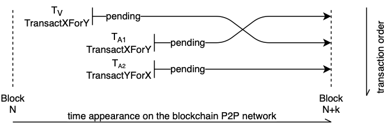
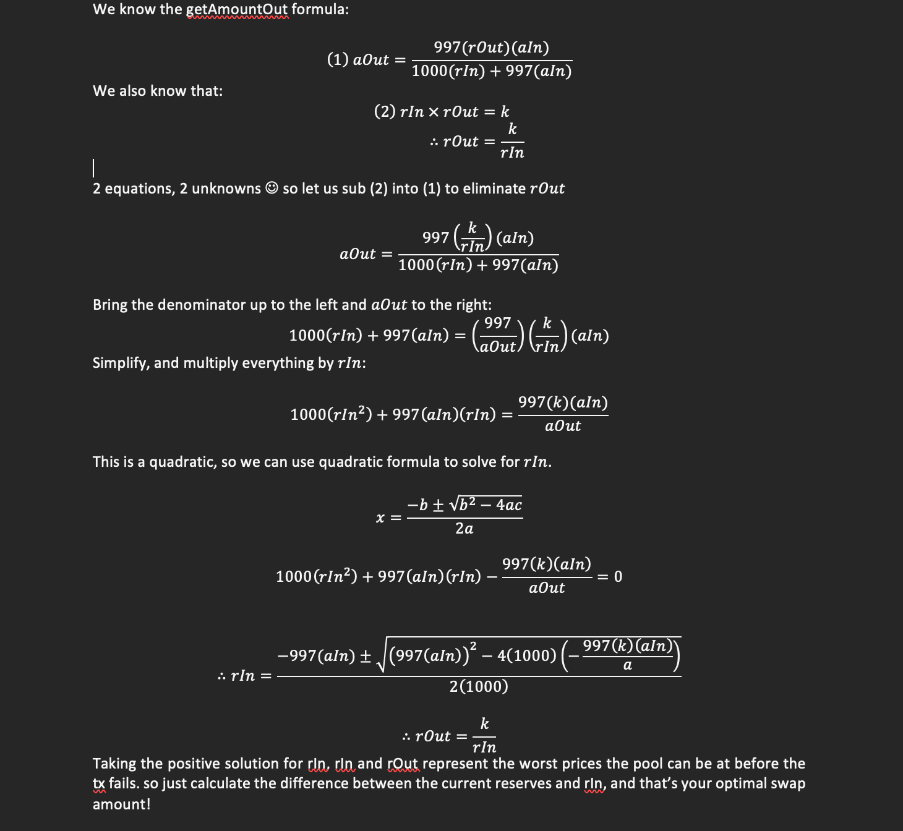

# MEV resistant DEX (Uniswap v2 fork)

### About:
An attempt to try and mitigate the negative effects of frontrunning attacks on Ethereum and other EVM based decentralized exchanges.
The bulk of of all MEV (maximal extractable value) can be categorized into 3 groups:

- Sandwich attacks (frontrun an order tx by buying and selling accordingly as to gain risk-free profit at the expense of high slippage)
- Arbitrage (take advantage of price imbalance between different exchanges)
- Liquidations (close (liquidate) positions when price negatively affects borrowed assets, sell off the collateral, return the borrowed asset and keep the change)

The purpose of this project is to try and prevent Sandwich attacks on a cloned Uniswap v2 exchange.

### The Problem
Often times DEX users find their orders getting executed at a much different price, usually just slightly above their slippage tolerance.
This imbalance is caused by sandwich attacks which negatively impact the victim's trade, effectively reducing the amount of tokens they would normally receive.



### Idea

[//]: # (It is probably impossible to have the same seamless UX that Uniswap provides without going offchain or altering any EVM code.  )
The proposed solution approaches sandwich mitigation at the contract level. For that we first need to understand how UniswapV2 trading works.
Usually uniswap users trade tokens through the official interface which calls the Router contract. The logic inside the Router contract ensures that the users slippage is enforced such that the tx reverts if the price changes too much in which case no swap is made.
Another relevant contract is the Pool which holds both traded assets (two erc20 tokens). The **Router** contract interacts with this contract by calling its **swap()** function. The **swap()** function ensures that all swaps are fairly priced based on its token reserves.

The modifications to the Router(UniswapV2Router02) and Pool (UniswapV2Pair) contracts allow for sandwich detection by adding some additional state variables and arrays that persist through each block.
The algorithm works in stages (resets for each new block):

[//]: # (- First swap in block sets )
- First detect if tx is being sandwich attacked. If AmountOut is calculated to be very close to maximum slippage (AmountOutMin in **Router** contract) we can assume that another tx is frontrunning us.
 We also calculate the optimal sandwich amountOut for the attacker given our slippage and other swap parameters and save the calculated amountOut to our array.
- Assuming that our tx did get attacked, the attacker still needs a successful backrun tx to complete so he can receive the tokens from the frontrun + profit. But since we know how much he expects to receive, we can revert the backrun transaction if its amountOut == (calculated amountOut from our Array). 
This check also works if backrun is split into different txs that sum up to (calculated AmountOut). 
- If any consecutive tx in the same block is also flagged as attacked (amountOut ~ amountOutMin) it repeats the process while simultaneously also being considered as a potential backrun tx.

### Optimal Sandwich attack
Onchain calculations for optimal InputAmount and sandwich profit can be made by using a formula better explained here: https://github.com/mevcheb/optimal-sandwich.

**All credits for optimal amount derivation go to github user @mevcheb**

### Code examples (Solidity)
As mentioned before, only parts that were updated are **UniswapV2Router02** and **UniswapV2Pair** contracts.
#### UniswapV2Pair declare a couple of new variables (UniswapV2Factory.sol: L:226-232)
```shell
uint[] public OptAmounts; // Store calculated amounts using optimal sandwich formula 
uint[] public SumToOptAmounts; // Sum all future swap AmountOut amounts and compare to values in OptAmounts

uint public blockNum = 0; // Set to track blockNumber, if change we reset the state 
int public pct; // Used to store % when predicting if slippage is maximized 
uint public start_reserve0; // Used to store reserves at each tx we detect an attack (used when calculating later opt. sandwich amounts) 
uint public start_reserve1; // Used to store reserves at each tx we detect an attack (used when calculating later opt. sandwich amounts)
```
#### UniswapV2Pair.swap() calls _flagSandwich() function at the end (UniswapV2Factory.sol: L:400)
The swap() function now receives a new parameter uint amountOutMin
`swap(uint amount0Out, uint amount1Out, address to, uint amountOutMin)`, `calldata data` that was ommitted for ease of use and to prevent stack too deep errors.
swap() contains the same trading logic as original uniswap code, with the added line at the end (L:397) where it calls the _flagSandwich() function.  
Check the comments in the code for better understanding, `console.log()` is a special hardhat debugging call. It should be removed on deployment.
```shell
    function _flagSandwich(uint _reserve0, uint _reserve1, uint amount1Out, uint amount0Out, uint amountOutMin, uint amount0In, uint balance0, uint balance1) private {
        console.log("Flag sandwich");
        if (blockNum != block.number){
            // If New block, reset the state variables
            delete OptAmounts;
            delete SumToOptAmounts;
            blockNum = block.number;
            start_reserve0 = _reserve0;
            start_reserve1 = _reserve1;

        }
        console.log("blockNum: %s", blockNum);
        console.log("Check Opt Amounts");
        // Check if current swap amountOut sums to any calculated OptAmounts
        for (uint i=0; i<OptAmounts.length; i++){
            SumToOptAmounts[i] += amount0Out;
            console.log("OptAmounts: %s", OptAmounts[i]);
            console.log("SumOptAmounts: %s", SumToOptAmounts[i]);
            pct = int(SumToOptAmounts[i] * 1000 / OptAmounts[i]) - 1000;
            pct = pct >= 0 ? pct: -pct;
            // If adding current amountOut sums to within 5% of calculated OptAmount we flag it as sandwich backrun tx and revert 
            require(pct > 50, "Sandwich attack detected, tx revert!");
        }
        console.log("Check if slippage minimized");
        console.log("AmountOutMin: %s Amount1Out: %s", amountOutMin, amount1Out);
        
        // Check if tx is targeted (amountOut is within 3% of amountOutMin).
        // amountOutMin == 0 is set when calling swap() directly, it indicates that the 
        // tx should not be considered as potential target since there is no slippage set.
        if ((amountOutMin > 0) && (amount1Out * 1000 / amountOutMin < 1030)) {

            uint k = start_reserve0 * start_reserve1;
            uint w = _worstReserves(amount0In, amount1Out, k, 997, start_reserve0, start_reserve1, balance0, balance1);
            OptAmounts.push(w);
            SumToOptAmounts.push(0);
            start_reserve0 = balance0;
            start_reserve1 = balance1;
            console.log("w: %s, SumToOptAmounts: %s", w, SumToOptAmounts[0]);
        }
    }
```
#### UniswapV2Pair._worstReserves() (UniswapV2Factory.sol, L:435)
The sandwich Optimal amountOut calculator, described in previous image. 
This function builds upon the derived formula and calculates the Optimal Amount Out for the backrun transaction. 
```shell
    function _worstReserves(uint amountIn, uint amountOut, uint k, uint fee, uint rIn, uint rOut, uint afterTargetRIn, uint afterTargetROut) public view returns (uint256){
        uint negb = (uint(fee) * uint(amountIn));
        uint fourac = (uint(4000) * uint(fee) * uint(amountIn) * uint(k))/uint(amountOut);
        uint squareroot = Math.sqrt(negb**2 + fourac);
        uint worstRIn = uint((squareroot-negb)/uint(2000));
        uint frontrunAmountIn = worstRIn - rIn;
        console.log(negb, fourac, squareroot);
        console.log("worstRIn: %s, rIn: %s", worstRIn, rIn);
        console.log("amountIn: %s, amountOut: %s, k: %s", amountIn, amountOut, k);
        console.log("rOut: %s, afterTargetRIn: %s, afterTargetROut: %s", rOut, afterTargetRIn, afterTargetROut);
        uint frontrunAmountOut = (fee*frontrunAmountIn*rOut)/(1000*rIn+fee*frontrunAmountIn);
        uint backrunAmountOut = (fee*frontrunAmountOut*afterTargetRIn)/(1000*afterTargetROut+fee*frontrunAmountOut);
        console.log("Frontrun amount in %s, backrun amount out %s", frontrunAmountIn, backrunAmountOut);
        return backrunAmountOut;
    }
```

#### UniswapV2Router02._swap() and all UniswapV2Router02 swap** functions (UniswapV2Router02.sol, L:434)
Router swap** functions calls UniswapV2Library.getAmountsOut() to calculate the correct amounts.
This function has been modified to return an array which contains 1 extra slot.
This slot is then used to store amountOutMin, which is necessary to calculate optimal sandwich amounts later. 
The amountOutMin is then passed as a separate uint parameter inside _swap() to the UniswapV2Pair.swap() function.

```shell
    function _swap(uint[] memory amounts, address[] memory path, address _to) internal virtual {
        for (uint i; i < path.length - 1; i++) {
            (address input, address output) = (path[i], path[i + 1]);
            (address token0,) = UniswapV2Library.sortTokens(input, output);
            uint amountOut = amounts[i + 1];
            (uint amount0Out, uint amount1Out) = input == token0 ? (uint(0), amountOut) : (amountOut, uint(0));
            address to = i < path.length - 2 ? UniswapV2Library.pairFor(factory, output, path[i + 2]) : _to;
            console.log("Calling pair swap %s %s", UniswapV2Library.pairFor(factory, input, output));
            console.log("Parameters %s", amount0Out);
            console.log("Parameters %s", amount1Out);
            console.log("Parameters %s", to);
            uint amountOutMin = amounts[amounts.length-1];
            console.log("Parameters %s", amountOutMin);
//            (uint reserve0, uint reserve1,) = IUniswapV2Pair(UniswapV2Library.pairFor(factory, input, output)).getReserves();
//            console.log("Reserves %s %s", reserve0, reserve1);
            IUniswapV2Pair(UniswapV2Library.pairFor(factory, input, output)).swap(
                amount0Out, amount1Out, to, amountOutMin
            );
        }
    }
```

# Disclaimer: 
For academic purposes only, sandwiching is unethical and most likely will be made illegal in the future. This version is still unstable, it only supports UniswapV2Router02.swapExactTokensForTokens() swaps and has not been tested for edge cases.
This project also does not prevent sandwich attacks entirely since the attacker can split the amounts among multiple tx across multiple blocks.
It was aimed at preventing flashbots style attacks where all txs must pass without reverts. In PGA(price gas auctions) the target will still lose it's slippage amount, since the frontrun tx lands onchain, but the backrun will revert. 
This mechanism would in theory discourage any rational bot operator from running the same attack further.   

### Environment setup and example
We use python with poetry/pyenv for test/deploy and hardhat for EVM network simulation.
Please use a linux base OS:
- Clone the repository
- Install pyenv and poetry (Or any other python env manager - make sure you use python 3.8.0)
- cd inside the uniswapV2MevMinimize folder and run `poetry install` (or just install web3 package, if using other env managers - see pyproject.toml)
- Initialize node project, type `npm init` and then install hardhat `npm install --save-dev hardhat`
- Run `npx hardhat` and select "Create an empty hardhat.config.js"
- Copy the contents of hardhat.config_template.js into hardhat.config.js file
- Run `npx hardhat compile && npx hardhat node` to start the node
- Activate your environment (`poetry shell`) and run `cd test && python PoolTest.py`

PoolTest.py contains all the off-chain logic to simulate a sandwich attack.
First it deploys all the necessary UniswapV2 contracts, then creates 2 new erc20 tokens and the UniswapV2Pair **Pool**.
It then loads the Attacker Wallet, Target Wallet and Pool with some amount of tokens.

The **Pool** contract now contains 50 of each token. Target address tries to exchange 20 base tokens for a minimum Output amount of 10 quote tokens.

In a fair system the target would receive almost the same amount (~19.5 quote tokens, according to constant product formula + fees),
however because of the frontrun tx it only receives ~ 10.01 tokens. 
```shell
Attacker base amount before:  500.0
Attacker quote amount before:  0.0
Target base amount before:  100.0
Target quote amount before:  0.0

Attacker base amount after:  488.67966311659546
Attacker quote amount after:  0.0
Target base amount after:  80.0
Target quote amount after:  10.009735547540197
```

Good news is that the Attacker did not receive any base tokens back, 
since the backrun tx was reverted. What is immediately noticable is that the attacker doesn't appear to have any quote tokens left.
This is because frontrun and backrun tx do not go through the Router contract, but are rather made up of 2 parts - the transfer (to the **Pool**) and the swap().
In this case the transfer call did go through, so the Attacker transferred the entire quote tokens amount but the swap reverted, trapping the transferred amount in the **Pool** contract.

We can also make sure that the backrun did indeed revert by checking the hardhat logs:

```shell
Error: VM Exception while processing transaction: reverted with reason string 'Sandwich attack detected, tx revert!'
            at UniswapV2Pair._flagSandwich (contracts/UniswapV2Factory.sol:421)
            at processTicksAndRejections (node:internal/process/task_queues:96:5)

```

TODO: 
- Fix the UniswapV2Router02._swap() code to work with all UniswapV2Router02.swap** functions.
- Add Uniswap UI
- Better detection logic - right now the mechanism will detect a high amount of false positives, reverting normal non MEV transactions. This can severely impact the UX, so adjustments have to be made.
